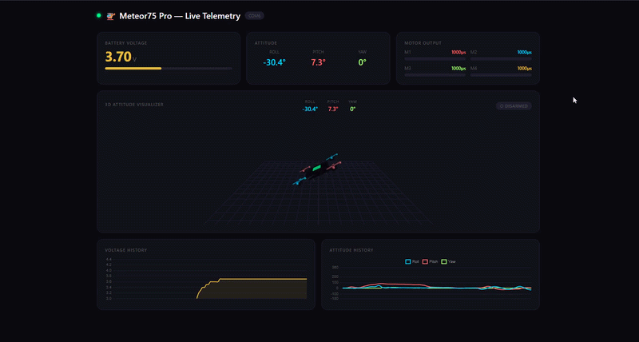

# 🚁 FPV Drone Telemetry Dashboard

A real-time telemetry dashboard for Betaflight flight controllers, built with Python and React.
Connects to your drone over USB and visualizes live flight data in the browser — no cloud, no app, just a cable.



---

## Features

- **Live telemetry** — battery voltage, roll, pitch, yaw, and motor output updated at 20Hz
- **3D attitude visualizer** — real-time Three.js drone model that rotates with your actual flight controller
- **Propeller animation** — props spin based on live motor output values
- **Auto-detection** — automatically finds your flight controller's COM port on startup
- **Smart voltage detection** — tries multiple MSP voltage commands and locks in whichever one works
- **Dynamic craft name** — pulls the drone name directly from Betaflight (no hardcoding)
- **Disconnect handling** — non-intrusive banner with port list when drone is unplugged, auto-rescans every 2 seconds
- **Live charts** — scrolling voltage history and attitude history graphs

---

## Tech Stack

| Layer | Technology |
|---|---|
| Backend | Python 3, `pyserial`, `websockets` |
| Protocol | MSP (MultiWii Serial Protocol) over USB |
| Frontend | React 18 (via CDN), Chart.js, Three.js |
| Transport | WebSocket |

---

## Hardware

Tested on Betaflight 4.x. Should be compatible with any flight controller 
firmware that supports MSP over USB, including iNav and Cleanflight, 
though this has not been verified.

---

## How It Works

```
Flight Controller (Betaflight)
        │
        │  USB (MSP Protocol)
        ▼
  drone_server.py
  - Sends MSP requests every 50ms
  - Reads attitude, voltage, motor data
  - Auto-detects working voltage command
        │
        │  WebSocket (ws://localhost:8765)
        ▼
    index.html
  - React dashboard
  - Three.js 3D visualizer
  - Chart.js live graphs
```

The backend communicates with the flight controller using the **MSP (MultiWii Serial Protocol)** — the same protocol Betaflight Configurator uses. It requests attitude, motor, and voltage data independently and streams it to the browser over WebSocket at 20Hz.

---

## Setup

### Requirements

- Python 3.8+
- A flight controller connected via USB
- A modern browser (Chrome recommended)

### Install dependencies

```bash
pip install -r requirements.txt
```

### Run

1. Plug in your drone via USB
2. Start the server:

```bash
python drone_server.py
```

3. Open `index.html` in your browser

The dashboard will auto-detect your flight controller and connect automatically.

### Windows one-click launch

Double-click `start.bat` to launch the server and open the browser in one step.

---

## Project Structure

```
fpv-telemetry-dashboard/
│
├── server/
│   └── drone_server.py     # Python WebSocket server, MSP communication
│
├── client/
│   └── index.html          # React dashboard (single file, no build step)
│
├── assets/
│   └── demo.gif            # Dashboard demo
│
├── requirements.txt        # Python dependencies
├── start.bat               # Windows one-click launcher
└── README.md
```

---

## MSP Commands Used

| Command | ID | Data |
|---|---|---|
| MSP_NAME | 10 | Craft name from Betaflight |
| MSP_ANALOG | 110 | Battery voltage (primary) |
| MSP_BATTERY_STATE | 130 | Battery voltage (fallback) |
| MSP_VOLTAGE_METER | 60 | Battery voltage (fallback) |
| MSP_ATTITUDE | 108 | Roll, pitch, yaw |
| MSP_MOTOR | 104 | Motor output (µs) |

---

## Known Limitations

- Windows only (tested on Windows 10/11)
- Yaw uses Euler angles — gimbal lock can cause brief jumps at extreme angles

---

## Future Ideas

- Blackbox log viewer tab
- Flight session logger (save to CSV)
- Low battery alert with sound
- MAVLink protocol support
- Electron app packaging for one-click install

---

## Author

**Kyrylo Holovatenko**
[github.com/kirboit](https://github.com/kirboit)
